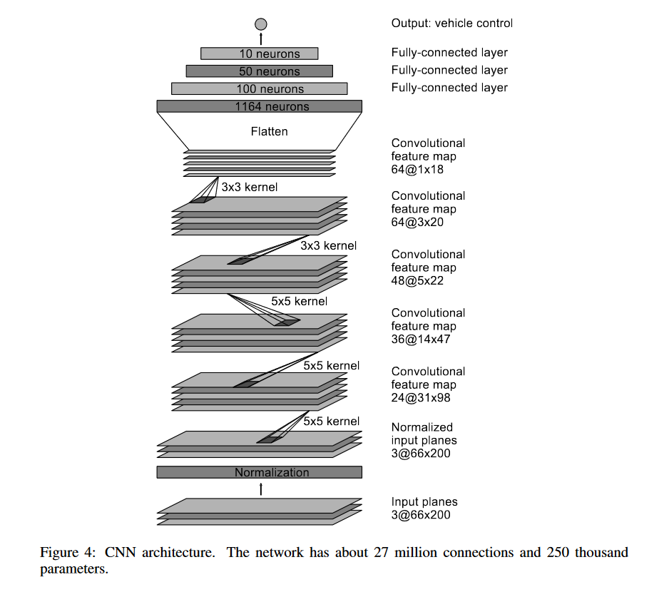
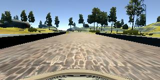
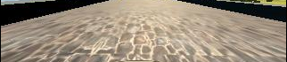
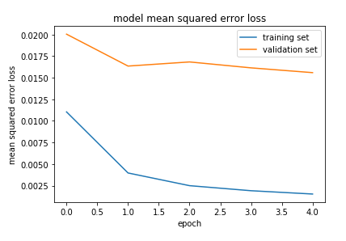
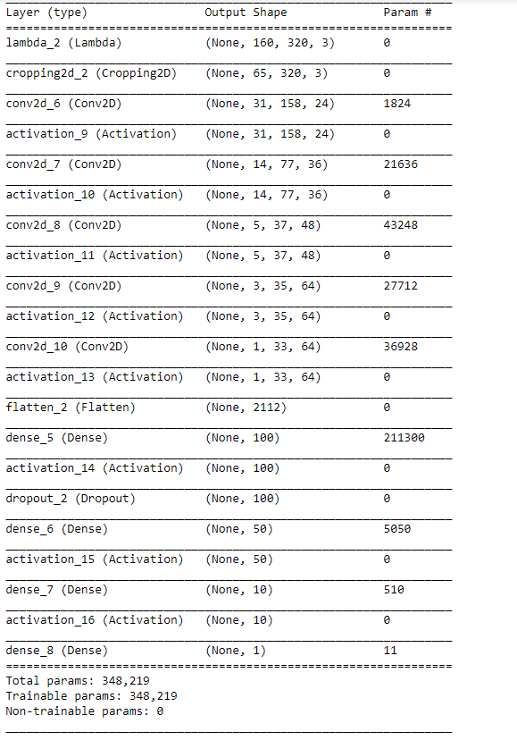

# **Behavioral Cloning** 

## Writeup Template

### You can use this file as a template for your writeup if you want to submit it as a markdown file, but feel free to use some other method and submit a pdf if you prefer.

---

**Behavioral Cloning Project**

The goals / steps of this project are the following:
* Use the simulator to collect data of good driving behavior
* Build, a convolution neural network in Keras that predicts steering angles from images
* Train and validate the model with a training and validation set
* Test that the model successfully drives around track one without leaving the road
* Summarize the results with a written report


## Rubric Points
### Here I will consider the [rubric points](https://review.udacity.com/#!/rubrics/432/view) individually and describe how I addressed each point in my implementation.  

---
### Files Submitted & Code Quality

#### 1. Submission includes all required files and can be used to run the simulator in autonomous mode

My project includes the following files:
* model.py containing the script to create and train the model
* drive.py for driving the car in autonomous mode
* model.h5 containing a trained convolution neural network 
* writeup_report.md or writeup_report.pdf summarizing the results

#### 2. Submission includes functional code
Using the Udacity provided simulator and my drive.py file, the car can be driven autonomously around the track by executing 
```sh
python drive.py model.h5
```

#### 3. Submission code is usable and readable

The model.py file contains the code for training and saving the convolution neural network. The file shows the pipeline I used for training and validating the model, and it contains comments to explain how the code works.

### Model Architecture and Training Strategy

#### 1. An appropriate model architecture has been employed
NVIDIA's model was deployed. The model architecture as described in the lesson takes i/p image of shape(60,266,3). Here we use it with the images that we have input images of dimention (160,320,3). 



#### 2. Attempts to reduce overfitting in the model

* Dropout layer with dropout rate of 0.25 is introduced after the fully connected layer to deal with overfitting.

* The model was trained and validated on different data sets to ensure that the model was not overfitting. The model was tested by running it through the simulator and ensuring that the vehicle could stay on the track.

#### 3. Model parameter tuning
##### Parameters:
* Optimizer - Adam
* Number of epochs - 5
* Learning rate - 0.001
* Validation Data split - 0.15
* Generator batch size - 32
* Correction factor - 0.2
* Loss function - MSE

#### 4. Appropriate training data

* The data provided by Udacity was used.

* OpenCv reads the images in BGR format, so the images were converted to RGB format inorder to suit it for drive.py.

* Steering angle is associated with three images so correction factor of 0.2 was introduced.For left camera feed, increase steering angle by 0.2 and thus for the right images decrease the steering angle by 0.2.



### Model Architecture and Training Strategy

#### 1. Solution Design Approach

* First of all the data provided by Udacity was loaded using OpenCv.

* Then after changing them to RGB format, correction factor of 0.2 was introduced to the steering angle.

* For preprocessing of images:
1. The images were shuffled so that we overcome the order dependency.
2. While Augumenting the data steering angle was multiplied by factor of -1 to get the steering angle for the flipped images.

`This gave 6 images corresponding to one entry in the csv file.`

* Udacity dataset was shuffled and then 15% of the data was kept for the validation.

* Generator was used inorder to save memory as we won't have to load all data at once this way. This way every time we need the data we can get data in batches of 32.

* Initially I tried to implement the LeNet architecture. This architecture was too shallow for the problem as it only has the output depth of 6. So inorder to implement an architecture that is deeper and well established for the autonomous vehicle, I chose the NVIDIA architecture.

* For NVIDIA architecture the output depth of convnet layer goes to 64 and that is deep enough for the given problem. After implementing the Architecture the vehicle started moving but it moved in a wavy way sometimes falling off the track.

* I started out with the normalizing the images.

* Then I cropped the images 70 pixels from top(to avoid sky) and 25 pixels from bottom(to avoid car's dashboard) to prevent the model from distractions.

Sample image


Cropped image


* Then the model was trained on the training set and tested on validation set.

* Plot for the MSE for training and validation sets implied the situation of overfitting. The validation set had high MSE.

* To deal with the overfitting condition, the model was modified by adding one dropout layer after fully connected layer.

* The model was trained again. 

* At the end the vehicle was able to drive in autonomous mode smoothly around the track without leaving the road.

After using this final architecture MSE on both training set and validation set, kept on decreasing.



#### 2. Final Model Architecture
The final model architecture looks as follows:




#### 3. Final video for Track 1 autonomous lap:
[link to my video result](./output_video.mp4)


#### Notes for complications:
soketio was producing errors due to version conflicts and it was solved by upgrading it with pip.


